<div align="center">

<picture>
  <source media="(prefers-color-scheme: dark)" srcset="dark.svg">
  <source media="(prefers-color-scheme: light)" srcset="light.svg">
  
</picture>

<br>

<a href="https://git.io/typing-svg">
  
</a>

<a href="https://git.io/typing-svg">
  
</a>

<br>


[](#)
[](#)
[](https://github.com/Ali-Irtza)

</div>

<br>

<div align="center">

## 🛰️ SYSTEM STATUS

```
> whoami
Ali Irtza — CS Graduate | AI/ML Specialist | Independent Builder

> location
Pakistan

> status
[ONLINE] Building AI-driven SaaS products & researching applied ML

> current_focus
Distributed systems · RAG pipelines · AI/ML research · Full-stack products
```

</div>

<br>

## 🧠 ABOUT ME

<table>
<tr>
<td width="60%" valign="top">

```
> cat about_me.txt
```

I'm a Computer Science graduate specializing in **AI/ML**, based in Pakistan, and I build things end-to-end — from the model to the shipped product.

- 🛠️ Independently building consumer & B2B SaaS products, from architecture to deployment
- 🔐 Final Year Project: an AI-driven C/C++ vulnerability detection platform — fine-tuned **Qwen2.5-Coder** with **QLoRA** across a two-stage pipeline (binary classification + CWE type prediction) on a merged ~315K-row dataset (ICVul + DiverseVul), with AST features via `tree-sitter`
- 📊 Built a distributed anomaly detection pipeline on NASA HTTP server logs using **Hadoop HDFS**, **Apache Spark**, K-Means, and Isolation Forest — achieved a ~0.99 silhouette score
- 💼 Freelance web development experience delivering production sites for real clients
- 🧬 Deep interest in **distributed systems**, **AI/ML research**, and **full-stack engineering**
- 📡 Currently exploring: Wi-Fi CSI-based motion sensing

```
> echo $STATUS
Compiling ideas into production code...
```

</td>
<td width="40%" valign="top" align="center">



</td>
</tr>
</table>

<br>

## 🧬 TECH STACK

<div align="center">

**Languages**
<br>


<br><br>

**AI / ML**
<br>


<br><br>

**Full-Stack & Backend**
<br>


<br><br>

**Data & Infra**
<br>


</div>

<br>

## 🚀 FEATURED PROJECTS

<table>
<tr>
<td width="50%" valign="top">

### 🛡️ SecureGuard Pro
**Final Year Project** — AI-driven C/C++ vulnerability detection platform. Fine-tunes Qwen2.5-Coder via QLoRA in a two-stage pipeline for binary classification + CWE type prediction, trained on a merged ~315K-row dataset (ICVul + DiverseVul) with AST features via tree-sitter.

`Python` `LLM Fine-Tuning` `QLoRA` `tree-sitter`

</td>
<td width="50%" valign="top">

### 🏠 Proptify
B2B marketplace selling exclusive property-owner insurance leads to licensed agents across all 50 US states. Tiered pricing, dispute resolution, Stripe Checkout, admin 2FA, IP allowlisting, and audit logging.

`Next.js` `Supabase` `Stripe` `Security`

</td>
</tr>
<tr>
<td width="50%" valign="top">

### 📄 InsureConnects
Consumer-facing insurance lead generation site — sibling brand feeding qualified leads into Proptify. Home & Auto quote flows with TCPA-compliant legal pages.

`Next.js` `Tailwind` `shadcn/ui` `Supabase`

</td>
<td width="50%" valign="top">

### 🔭 More on the way
Actively building and shipping — check pinned repos for the latest.

</td>
</tr>
</table>

<br>

## 📊 GITHUB ANALYTICS

<div align="center">


</div>

<br>

## 🐍 CONTRIBUTION SNAKE

<div align="center">


</div>

<br>

## 📡 TRANSMISSION CHANNELS

<div align="center">

[](#)
[](#)
[](https://github.com/Ali-Irtza)

<br>

`> connection established. thanks for stopping by.`

</div>
