<div align="center">

<picture>
  <source media="(prefers-color-scheme: dark)" srcset="dark.svg">
  <source media="(prefers-color-scheme: light)" srcset="light.svg">
  
</picture>

<br>

<a href="https://git.io/typing-svg">
  
</a>

<a href="https://git.io/typing-svg">
  
</a>

<br>


<a href="https://www.linkedin.com/">
  
</a>
<a href="mailto:YOUR_EMAIL_HERE">
  
</a>
<a href="https://github.com/Ali-Irtza">
  
</a>

</div>

<br>

## 🧠 ABOUT ME

<table>
<tr>
<td width="54%" valign="middle">

```text
> cat about_me.txt
```

I don't build for the sake of building. I build because most problems deserve better solutions than they're getting.

That's the difference between someone who "knows AI" and someone who actually ships AI-driven products into the real world. I've done both sides of that gap: the deep technical work (fine-tuning models, building ML pipelines, wrestling with production-grade RAG systems) and the business side (pricing, payments, user experience, the boring-but-critical stuff that makes a product actually usable).

Most people can write code. Fewer people can turn an idea into something that works, scales, and makes sense as a business. That's the part I care about — not just "does it run," but "does it hold up."

I move fast, I own outcomes, and I don't need a team of five to get something out the door. If you're looking for someone who can take a rough idea and turn it into a real, working product — that's the work I want.

Currently open to **freelance projects** and **full-time roles** where I can do exactly that.

```text
> echo $STATUS
Turning difficult problems into systems that work.
```

</td>

<td width="46%" valign="middle" align="center">

<picture>
  <source media="(prefers-color-scheme: dark)" srcset="about-dark.svg">
  <source media="(prefers-color-scheme: light)" srcset="about-light.svg">
  
</picture>

</td>
</tr>
</table>
<br>

## 🧬 TECH STACK

<div align="center">

**Languages**
<br>


<br><br>

**AI / ML**
<br>


<br><br>

**Full-Stack & Backend**
<br>


<br><br>

**Data & Infra**
<br>


</div>

<br>

## 🚀 FEATURED PROJECTS

<table>
<tr>
<td width="50%" valign="top">

### 🛡️ SecureGuard Pro
**Final Year Project** — AI-driven C/C++ vulnerability detection platform. Fine-tunes Qwen2.5-Coder via QLoRA in a two-stage pipeline for binary classification + CWE type prediction, trained on a merged ~315K-row dataset (ICVul + DiverseVul) with AST features via tree-sitter.

`Python` `LLM Fine-Tuning` `QLoRA` `tree-sitter`

</td>
<td width="50%" valign="top">

### 🏠 Proptify
B2B marketplace selling exclusive property-owner insurance leads to licensed agents across all 50 US states. Tiered pricing, dispute resolution, Stripe Checkout, admin 2FA, IP allowlisting, and audit logging.

`Next.js` `Supabase` `Stripe` `Security`

</td>
</tr>
<tr>
<td width="50%" valign="top">

### 🩺 MediBot
AI-powered medical chatbot built on a Retrieval-Augmented Generation pipeline — grounds every answer in a curated medical knowledge base instead of relying on raw model recall, cutting down hallucinated responses. Handles symptom-based Q&A, contextual follow-ups, and cites the source passages behind each answer.

`Python` `LLM` `RAG` `Vector DB`

</td>
<td width="50%" valign="top">

### 🔭 More on the way
Actively building and shipping — check pinned repos for the latest.

</td>
</tr>
</table>

<br>

## 📊 GITHUB ANALYTICS

<div align="center">


</div>

<br>

## 🐍 CONTRIBUTION SNAKE

<div align="center">


</div>

<br>

## 📡 TRANSMISSION CHANNELS

<div align="center">

<a href="https://www.linkedin.com/">
  
</a>
<a href="mailto:YOUR_EMAIL_HERE">
  
</a>
<a href="https://github.com/Ali-Irtza">
  
</a>

<br>

`> connection established. thanks for stopping by.`

</div>
